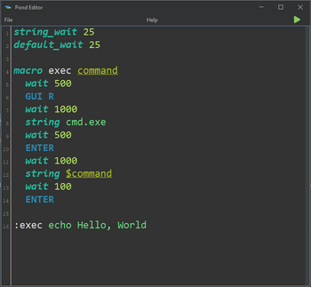

# 🦆 Pond Script


The improved scripting language for USB rubber duckies

## 🏌️ What is pond?

Pond as a language is the improved big brother of DuckyScript with lots of new features and new syntax elements such
as **macros** and **variables** it also has a handy editor with code completion and syntax highlighting.



## 📌 Keyboard Layout Support

Currently, Pond only supports the US keyboard layout for compiling scripts, but I expect to add more later on

## 💻 Testing

With the Pond editor you can push the green run button in the top right corner to test your code on your local computer
without having to execute it on a ducky.

## 🐵 Upcoming Features
- Case-insensitive key names
- Editor Layout/Navigation Improvements

## 🚀 Syntax

The syntax for pond is very simple and relies on indentation  
(Note keywords are case-insensitive but keys are not)

### ⌨️ Typing characters

You can type out lots of characters using the `STRING` the following is an example of this

```pond
STRING Here is a long line of characters
```

This will type "Here is a long line of characters" when executed

#### Changing the typing speed

You can change the delay before each character gets typed using the `STRING_WAIT` keyword it can be used in the same way
that `WAIT` is used and will apply to all instructions after it

```pond
STRING_WAIT 25
```

This will wait 25 milliseconds before typing the next character

### ⏱ Delaying Execution

To wait a specific delay before executing the next instruction you can use the `WAIT` keyword the following is an
example of this

```pond
WAIT 500
```

This will wait 500 milliseconds before running the next line

#### Delaying By Default

You can also set a default delay, this will be applied to every instruction after it you can do this with
the `DEFAULT_WAIT` keyword the same way you would use the `WAIT` keyword

```pond
DEFAULT_WAIT 500
```

This will wait 500 milliseconds before each instruction

### 📦 Variables

You can set variables to reuse throughout your code using the `SET` keyword. It can be used like the following

```pond
SET VARIABLE_NAME John Doe
```

This defines VARIABLE_NAME as "Hello, World"
we can then go somewhere else in our code and use the following to access it

```pond
STRING Hello, $VARIABLE_NAME
```

This will type out "Hello, John Doe"
You can also use variables for storing values to use with the wait keywords

```pond
SET DELAY 250
WAIT $DELAY
```

Will wait 250 milliseconds

### 🧰 Macros

You can define macros which are sets of reusable code that you can pass parameters too. You can define a macro with the
following
`# NOTE MACROS REQUIRE INDENTATION OF TWO SPACES`

```pond
MACRO MY_MACRO ARG1
  STRING Argument 1 is $ARG1
  ..etc etc
```

This will define a macro with the name of MY_MACRO and one argument named ARG1 you can reference this macro using the
following

```pond
:MY_MACRO My Example Arg
```

This will use the macro MY_MACRO passing it the "My Example Arg" as ARG1 which will type out "Argument 1 is My Example
Arg"

You can pass multiple arguments into a macro such as the following

```pond
MACRO MY_MACRO ARG1 ARG2 ARG3
    STRING Hello, $ARG1 you are $ARG2 and $ARG3 years old
    ..etc etc
```

This can be then accessed with

```pond
:MY_MACRO John Doe | Male | 18
```

This will type out "Hello, John Doe you are Male and 18 years old"

### ♻️ Repeating Blocks

You can define repeating blocks of script these will repeat everything in its scope the specified amount of times you
can define one like so

```pond
REPEAT 10
  ALT F4
  ..etc etc
```

This will press ALT + F4 10 times

### 🥣 Internal Macros

I plan on adding lots of internal macros currently there is only one, and it is named cmd this macro opens a command
prompt window. Note user defined macros take priority over internal macros, so you can easily redefine cmd as something
else. To access this macro you can use the macro invoke syntax

```pond
:cmd
```

## 🕹 Keyboard Shortcuts

The editor has some useful keyboard shortcuts for ease of access

| Combo            | Details                                       |
|------------------|-----------------------------------------------|
| CTRL + SHIFT + S | Save As - Opens the save as file dialog       |
| CTRL + S         | Save - Saves the currently open file          |
| CTRL + O         | Open - Opens a browse files dialog            |
| CTRL + N         | New - Clears the editor opening a blank file  |
| CTRL + H         | Help - Opens the help dialog                  |
| ALT + C          | Compile - Compiles the current content        |
| F5               | Run - Runs the current content                |

## 📦 Building

To build the jar you can run the following gradle command

```shell
./gradlew fatJar
```

This will produce a jar file at ./build/libs/Pond-VERSION.jar
